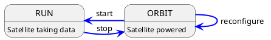

# Implementing a Satellite (C++)

This tutorial will walk through the implementation of a new satellite, written in C++, step by step. The entire
procedure should not take too long, but this of course depends on the complexity of the satellite functionality.
It is recommended to have a peek into the overall [concept of satellites](../../operator_guide/concepts/satellite.md)
in Constellation in order to get an impression of which functionality of the application could fit into which state of the
finite state machine.

```{seealso}
This how-to describes the procedure of implementing a new Constellation satellite in C++. For Python look [here](./satellite_py.md)
and for the microcontroller implementation, please refer to the [MicroSat project](https://gitlab.desy.de/constellation/satellites/microsat/).
```

## Implementing the FSM Transitions

In Constellation, actions such as device configuration and initialization are realized through so-called transitional states
which are entered by a command and exited as soon as their action is complete. The actions attached to these transitional
states are implemented by overriding the virtual methods provided by the
{cpp:class}`Satellite <constellation::satellite::Satellite>` base class.

For a new satellite, the following transitional state actions **should be implemented**:

* `void ExampleSatellite::initializing(Configuration& config)`
* `void ExampleSatellite::launching()`
* `void ExampleSatellite::landing()`
* `void ExampleSatellite::starting(std::string_view run_identifier)`
* `void ExampleSatellite::stopping()`

The following transitional state actions are optional:

* `void ExampleSatellite::reconfiguring(const Configuration& partial_config)`: implements a fast partial reconfiguration of the satellite, see [below](#to-reconfigure-or-not-to-reconfigure) for a detailed description.
* `void ExampleSatellite::interrupting()`: this is the transition to the `SAFE` state and defaults to `stopping` (if necessary because current state is `RUN`), followed by `landing`. If desired, this can be overwritten with a custom action.

For the steady state action for the `RUN` state, see [below](#running-and-the-stop-token).

## Reading Configuration Parameters

```{caution}
Reading information from the satellite configuration is only possible in the `initializing` function.
All parameters the satellite requires should be read and validated in this function, the `launching` function should only be used to apply this configuration to hardware.
```

Configuration parameters can be read using the `get` method on the `Configuration` object:

```cpp
void ExampleSatellite::initializing(Configuration& config) {
    // Read voltage as double
    const auto voltage = config.get<double>("voltage");

    // Read channel as integer, with default value 1 if not given in config file
    // Note: this also sets the default value, so it will appear when using the get_config command
    const auto channel = config.get<int>("channel", 1);
}
```

Several other `get` methods exists for convenience:

* `getOptional`: get an `std::optional` instead of throwing a `MissingKeyError` exception if the key is not present
* `getArray`, `getOptionalArray`: get an `std::vector`
* `getSet`, `getOptionalSet`: get an `std::set`
* `getPath`, `getPathArray`: get an `std::filesystem::path`

To access nested configuration sections, `getSection` can be used:

```cpp
// Get configuration section for channels
auto& channels_section = config.getSection("channels");

// Read channel 0 & 1 as nested configuration sections
for(auto n : {0, 1}) {

  // Get section for channel n
  auto& channel_section = config.getSection("channel_" + to_string(n));

  // Note that channel_section has the same methods available as config

  // Get voltage for channel
  const auto voltage = channel_section.get<double>("voltage");
}
```

```{seealso}
More details about configuration sections and their intricacies can be found in the dedicated [chapter on Configuration Sections](../functionality/configuration_sections.md).
```

In addition to the `get` methods, following methods might be helpful when reading the configuration:

* `has`: checks if a key is present in the configuration
* `count`: counts how many of the given keys are present in the configuration, useful to check for invalid key combinations (see also [error handling](#configuration-errors))
* `setAlias`: can be used to set an alias for a renamed key

## Running and the Stop Token

The satellite's `RUN` state is governed by the `running` action, which - just as the transitional state actions above - is overridden from the `Satellite` base class.
The function will be called upon entering the `RUN` state (and after the `starting` action has completed) and is expected to finish as quickly as possible when the
`stop` command is received. The function comes with the `stop_token` parameter which should be used to check for a pending stop request, e.g. like:

```cpp
void ExampleSatellite::running(const std::stop_token& stop_token) {

    while(!stop_token.stop_requested()) {
        // Do work
    }

    // No heavy lifting should be performed here once a stop has been requested
}
```

Any finalization of the measurement run should be performed in the `stopping` action rather than at the end of the `running` function, if possible:

```cpp
void ExampleSatellite::stopping() {
    // Perform cleanup action here
}
```

## To Reconfigure or Not To Reconfigure

Reconfiguration (partial, fast update of individual parameters) is an optional transition from `ORBIT` to `ORBIT` state. It can
be useful to implement this to allow e.g. fast parameter scans which directly cycle from `RUN` to `ORBIT`, through reconfigure
and back to `RUN`:



without the necessity to land and complete re-initializing the satellite.

However, not all parameters or all hardware is suitable for this, so this transition is optional and needs to be explicitly
enabled in the constructor of the satellite:

```cpp
ExampleSatellite(std::string_view type, std::string_view name) : Satellite(type, name) {
   support_reconfigure();
}
```

and the corresponding transition function `reconfiguring(const config::Configuration& config)` needs to be implemented.

The payload of this method is a partial configuration which contains only the keys to be changed. The satellite
implementation should check for the validity of all keys and report in case invalid keys are found.

## Setting Status Messages

In addition to its state, each satellite also exposes a status message that provides additional human-readable information
on how this state was reached.

```{seealso}
More information on the state and status message can be found in the
[Operator Guide's section on satellites](https://constellation.pages.desy.de/operator_guide/concepts/satellite.html#state-and-status).
```

From C++, the status message can be configured from transitional states as follows:

```cpp
void ExampleSatellite::launching() {
    submit_status("Successfully launched, 16 channels ramped up");
}
```

This status will be adopted by the satellite at the end of the transitional state. It should be noted that, consequently, it
is not possible to set multiple status messages during a single transitional state. Any further call to `submit_status(/*...*/)`
will overwrite previously submitted status messages. For more fine-grained information, logging should be used.

## Error Handling

Any error that prevents the satellite from functioning (or from functioning *properly*) should throw an exception to notify
the framework of the problem. The Constellation core library provides different exception types for this purpose.

### Generic Errors

* `SatelliteError` is a generic exception which can be used if none of the other available exception types match the situation.
* `CommunicationError` can be used to indicate a failed communication with attached hardware components.

### Configuration Errors

* `InvalidValueError` should be used when a value read from the configuration is not valid.
* `InvalidCombinationError` should be used when an invalid combination of configuration keys is present.

The message provided with the exception should be as descriptive as possible. It will both be logged and will be used as
status message by the satellite.
