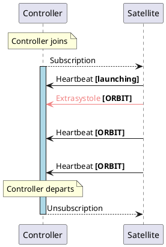
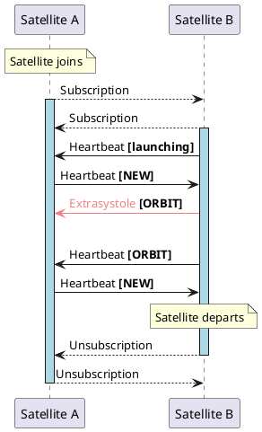
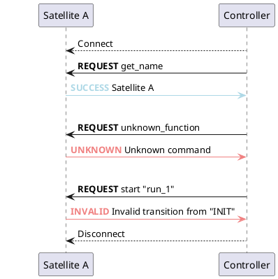
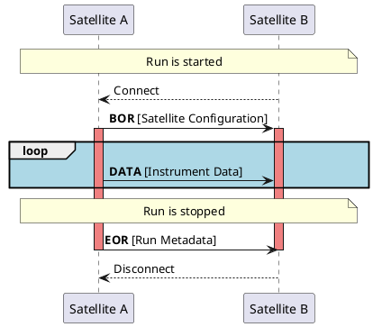
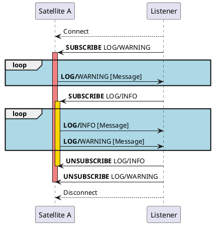
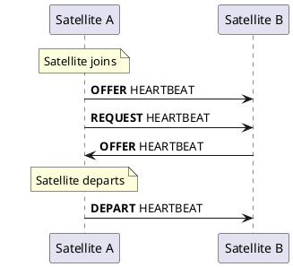

# Communication Protocols

Constellation is built around a set of communication protocols among its constituents. These protocols are well-defined and have been defined
early on and serve as platform- and implementation-independent architecture of the framework, meaning that new implementations of e.g. a satellite can be written in any language.
The communication channels are independent of each other and follow clear communication patterns such as publish/subscribe for one-to-many distribution of information
or request/reply for a client-server-based communication.

Most of the protocols are TCP/IP communication based on the [ZeroMQ messaging library](https://zeromq.org/) and build upon the ZeroMQ Message Transport Protocol.
The protocols are documented in RFC-style documents, including an [ABNF description](https://en.wikipedia.org/wiki/Augmented_Backus%E2%80%93Naur_form)
where relevant, and can be found in the appendix of this manual.

The five Constellation communication protocols are described in the following, ordered by significance of the information passed.

## Autonomous Operation

Autonomous operation of the Constellation requires constant exchange of state information between all participants. This is
implemented via heartbeats send via the Constellation Heartbeat Protocol (CHP). Heartbeat messages contain

* A timestamp when the heartbeat was sent
* The current state of the sender finite state machine
* A set of flags indicating the desired treatment of the sender
* The time interval after which the next heartbeat is to be expected.

With this information, heartbeat receivers can deduce independently whether a remote system is in {bdg-secondary}`ERROR` state
or not responding due to network or machine failure, and how to react to this information.

In addition to regular heartbeat patterns, so-called extrasystoles are sent out-of-order whenever the state of the sender
changes. This enabled immediate reaction to remote state changes without having to wait for the next regular heartbeat update
interval.

Be low are two sequence diagrams illustrating the heartbeat exchange, once for the communication between a controller instance and a satellite,
and once for the heartbeat exchange between two satellites. Extrasystole messages that are sent at state changes are indicated in red, the activation
bars indicate times of active heartbeat monitoring of the remote satellite.

::::{grid} 1 1 2 2

:::{grid-item-card}
**Heartbeats with Controller & Satellite**
^^^^^^^^^^^^

:::

:::{grid-item-card}
**Heartbeats between Satellites**
^^^^^^^^^^^^

:::

::::

## Command & Controlling

Commands from controller instances to satellites are transmitted via the Constellation Satellite Control Protocol (CSCP). It
resembles a client-server architecture with the typical request-reply pattern. Here, the satellite acts as the server while
the controller assumes the role of the client.

::::{grid}

:::{grid-item-card}
**Command Communication between Controller & Satellite**
^^^^^^^^^^^^

:::

::::

## Data Transmission

Data are transferred within a Constellation network using the Constellation Data Transmission Protocol (CDTP). It uses
point-to-point connections via TCP/IP, which allow the bandwidth of the network connection to be utilized as efficiently as
possible. The message format transmitted via CDTP is a lightweight combination of the sender's name, the message type and any
amount of data records. A data record consists of a sequence number, a dictionary and any number of data blocks.

CDTP knows three different message types:

* `BOR` - Begin of Run: This message is sent automatically at the start of a new measurement, i.e. upon entering the `RUN`
  state of the finite state machine of the sending satellite. It marks the start of a measurement in time and contains
  exactly two data records. The dictionary of the second record contains the configuration of the sending satellite, while
  the dictionary in first record might contain additional information of the sending satellite not contained in the
  configuration.
* `DATA`: This is the standard message type of CDTP. The data record contain undecoded raw data of the respective instrument
  and the message sequence counts up with every message (starting from 1), providing additional possibility for checking data
  integrity offline.
* `EOR` - End of Run: This message is sent automatically at the end of a measurement, i.e. upon leaving of the `RUN` state by
  the sending satellite. It contains exactly two data records. The dictionary of the second record contains the run metadata
  collected by the framework, while the dictionary in first record might contain additional information of the sending
  satellite not in the run metadata generated by the framework.

Only `DATA` messages can be transmitted by satellite implementations, both `BOR` and `EOR` messages are handled automatically.

::::{grid}

:::{grid-item-card}
**Data Transmission Sequence**
^^^^^^^^^^^^

:::

::::

## Monitoring

The distribution of log messages and performance metrics within Constellation is handled by the Constellation Monitoring Distribution Protocol (CMDP).
The protocol is built around publisher and subscriber sockets which allow one-to-many distribution of messages. Subscriptions to logging levels
or metrics are completely independent of the current FSM state and can be performed at any time. This means that hosts listening and displaying
e.g. log messages can be ended and restarted and the subscriptions can be changed while the Constellation is running undisturbed.
The protocol features message filtering for data efficiency and minimal bandwidth usage. This means that a host only sends messages over the
protocol for which a subscription is present.

The same protocol is used for log messages and performance metrics. The following log levels are defined:

* `TRACE` messages are be used for very verbose information which allows to follow the program flow for development purposes. This concerns, for example, low-level code for network communication or internal states of the finite state machine. The messages of this level also contain additional information about the code location of the program where the message has been logged from.
* `DEBUG` messages contain information mostly relevant to developers for debugging the program.
* `INFO` messages are of interest to end users and should contain information on the program flow of the component from a functional perspective. This comprises, e.g. reports on the progress of configuring devices.
* `WARNING` messages indicate unexpected events which require further investigation by the user.
* `STATUS` messages are used communicate important information on a low frequency such as successful state transitions.
* `CRITICAL` messages notify the end user about critical events which require immediate attention. These events may also have triggered an automated response and state change by the sending host.

The CMDP protocol support subtopics, which are appended to the log level. This allows to select only the relevant slice of information from an otherwise very verbose
log level and therefore reduce the network bandwidth required. An example would be selecting only the `TRACE` messages relevant for network communication by
subscribing to the topic `TRACE/NETWORKING`.

Apart from log messages, CMDP is also used to transmit performance metrics such as the current trigger rate, the number of recorded events, temperature or CPU loads.
These messages are published under their respective topics and subscribers can choose the variables they want to follow.

::::{grid}

:::{grid-item-card}
**Subscription to Log Topics**
^^^^^^^^^^^^

:::

::::

## Network Discovery

A common nuisance in volatile networking environments with devices appearing and disappearing is the discovery of available devices and services.
While some established protocols exist for the purpose of finding services on a local network, such as zeroconf or avahi, these come with significant
downsides such as missing standard implementations, being limited to individual platforms, or a large and complex set of features not required for the
purpose of Constellation.

Hence, the Constellation Host Identification & Reconnaissance Protocol (CHIRP) has been devised. It is a IPv4 protocol
intended to be used on local networks only which uses a set of defined beacons sent as multicast messages over UDP/IP to
announce or request services. The beacon message contains a unique identified for the host and its Constellation group, the
relevant service as well as IP address and port of the service. Three such beacons exist:

* `OFFER`: A beacon of this type indicates that the sending host is offering the service at the provided endpoint.
* `REQUEST`: This beacon solicits offers of the respective service from other hosts.
* `DEPART`: A departing beacon is sent when a host ceases to offer the respective service.

Each service the participating Constellation host offers is registered with its CHIRP service. Upon startup of the program, a `OFFER` beacon is sent
for each of the registered services.
The `REQUEST` beacon allows hosts to join late, i.e. after the initial `OFFER` beacons have been distributed. This means that at any time of the
framework operation, new hosts can join and request information on a particular service from the already running Constellation participants.
A clean shutdown of services is possible with the `DEPART` beacon which will prompt other hosts to disconnect.

::::{grid}

:::{grid-item-card}
**Discovery Message Communication**
^^^^^^^^^^^^

:::

::::
