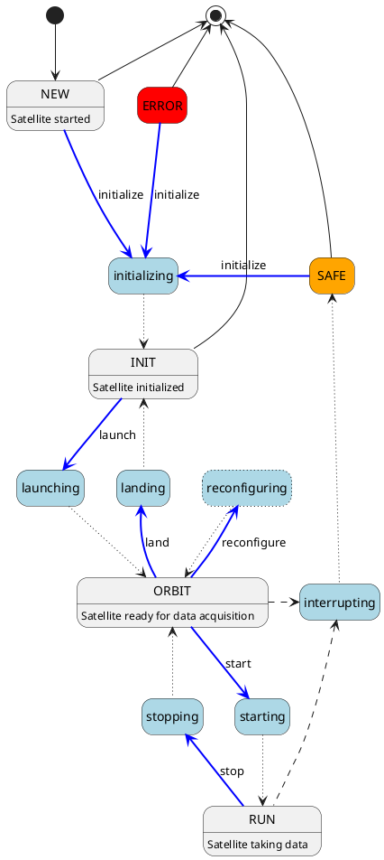

# Satellite Implementation Guidelines

The following guidelines should be followed when implementing a satellite base class for Constellation.

```{note}
These guidelines are only relevant for developing the Constellation framework itself, **not for the implementation of user satellites**.
These pages contain detailed technical information concerning the communication between Constellation components and the required
minimal set of functionality for them to interoperate with each other.
```

## Names

The full canonical name of a satellite consists of its type and its name:

* The name of the satellite is a user-chosen name, which can only consist of alphanumeric characters or underscores (in regex: `\w+`)
* The type the satellite corresponds to the class name of the satellite implementation
* The canonical name of the satellite consists of the above information in the form "type.name"

The canonical name of a satellite must be unique and is used throughout the framework for identification. This name should
appear in configuration files and will be sent as the "sending host" information in message header frames.

## Satellite Startup & Shutdown

When a new satellite application is started, the state of its FSM **shall always** be `NEW`.

Shutting down a satellite application is possible in three different ways:

* sending the command `shutdown` through CSCP: The satellite **shall** only react to this transition when in `NEW`, `INIT`, `SAFE` or `ERROR` state.
* requesting a graceful shutdown through `SIGINT` or `SIGTERM` signals: The satellite **shall** go through the `interrupting` transitional state if necessary and exit either from `INIT` or `SAFE` state.
* requesting a forceful shutdown through `SIGQUIT` or `SIGABRT` signals: The satellite application **should** exit the process immediately.

## Satellite Commands

Each satellite **must** be able to understand and answer to the following commands, and it **must** accept or provide the
corresponding payloads. Verbs and commands are always transmitted as native strings, payloads are always encoded as MsgPack
objects.

| Command | payload | verb reply | payload reply | metadata reply
| ------- | ------- | ---------- | ------------- | --------------
| `get_name` | - | Canonical name of the Satellite | - | -
| `get_version` | - | Constellation version identifier string | - | -
| `get_commands` | - | Acknowledgement | List of commands as MsgPack map/dictionary with command names as keys and descriptions as values | -
| `get_state` | - | Current state as string | Current state encoded as MsgPack integer | `last_changed` contains the time when the state last changed as MsgPack timepoint
| `get_status` | - | Current status | - | -
| `get_config` | - | Acknowledgement | Satellite configuration as flat MsgPack map/dictionary | -
| `get_run_id` | - | Current or last run identifier (as string) | - | -
| `initialize` | Satellite configuration as flat MsgPack map/dictionary | Acknowledgement | - | -
| `launch` | - | Acknowledgement | - | -
| `land` | - | Acknowledgement | - | -
| `reconfigure` | Partial configuration as flat MsgPack map/dictionary | Acknowledgement | - | -
| `start` | Run identifier as MsgPack string | Acknowledgement | - | -
| `stop` | - | Acknowledgement | - | -
| `shutdown` | - | Acknowledgement | - | -

Command names shall only contain alphanumeric characters or underscores and cannot start with a digit (in regex: `\D\w*`).
The run identifier shall only contain alphanumeric characters, underscores or dashes (in regex: `[\w-]+`).

## FSM States

The state can be encoded in a single-byte value.

State values with the lower four bits set to zero indicate steady states. For state values with non-zero lower four bits, the higher four bits indicate the steady state they enter into.

The following states are defined:

* `0x10` - NEW
* `0x12` - initializing
* `0x20` - INIT
* `0x23` - launching
* `0x30` - ORBIT
* `0x32` - landing
* `0x33` - reconfiguring
* `0x34` - starting
* `0x40` - RUN
* `0x43` - stopping
* `0x0E` - interrupting
* `0xE0` - SAFE
* `0xF0` - ERROR

## FSM State & Transition Diagram

The following diagram represents all possible transitions and states of the Constellation FSM. The different colors and line
styles indicate different types of transitions and states:

* Gray boxes represent steady states which are left only through an error condition or user intervention.
* Light blue boxes represent transitional states which are exited as soon as their defined action has been completed.
* Dark blue arrows indicate transitions triggered by user-interaction
* Dotted lines indicate automatic transitions, triggered upon action completion
* Dashed lines indicate transitions triggered by an error condition.

It should be noted that every state can transit into the `ERROR` state and corresponding arrows for these transitions are
omitted from the diagram for clarity.



## Autonomous Transitions

The satellite **should** automatically and autonomously initiate the `interrupting` transition to the `SAFE` steady state
under the following conditions:

* The CHP instance reports that a previously tracked remote satellite became unavailable
* The CHP instance reports that the state of a tracked remote satellite changed to `ERROR` or `SAFE`

## Data Sending and Receiving

BOR and EOR messages of [CDTP](./protocols.md#data-transmission) allow for the transport of both user-supplied information in the form of header tags and framework-generated
information in the payload:

* The BOR message contains user-provided metadata tags in its header and the framework-provided configuration object of the satellite as payload
* The EOR message contains user-provided metadata tags in its header and a framework-generated dictionary with internal run
  metadata such as total transmitted bytes, run identifier, or timestamp of the run end.

If a data sending satellite provide the relevant information, it should add `timestamp_begin` and `timestamp_end` tags to DATA messages in [CDTP](./protocols.md#data-transmission), containing integer values with the timestamps in picoseconds counted since the start of the measurement marking the begin and end of this data block, respectively.
