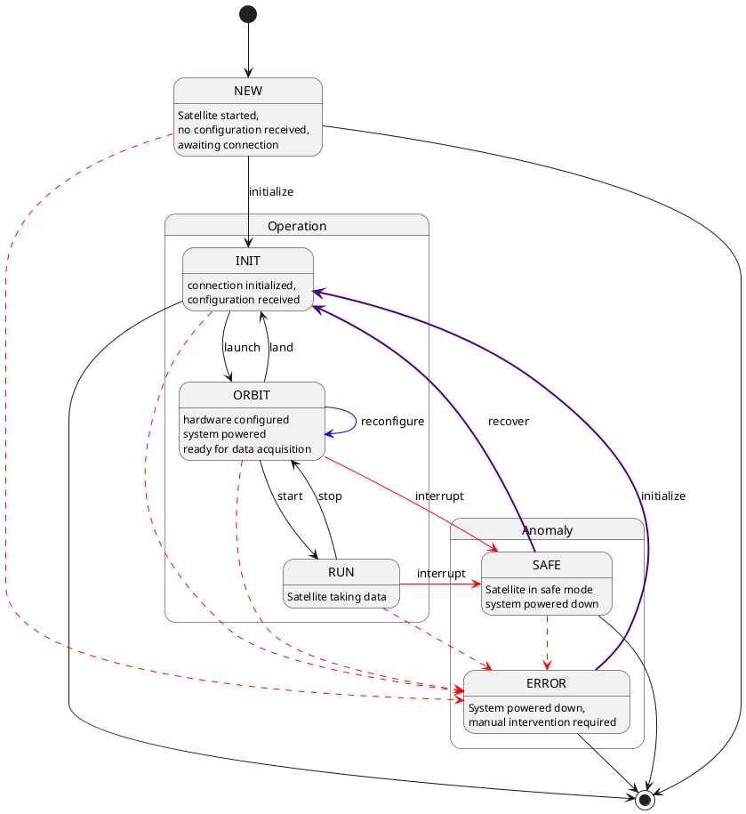

# The Constellation Satellite

The central components of a Constellation network are satellites. A satellite is a program for controlling an instrument and
is built around a finite state machine. It is the only component in a Constellation which partakes in all Constellation
protocols. In the following, the main features of the Constellation Satellite are described.

* importance?

## The Finite State Machine

The finite state machine (FSM) controls the behavior of the satellite and guarantees that the system is always in a defined state.
The FSM has been designed carefully to strike the balance between robustness, features, and simplicity.
State transitions are either initiated by a controller sending transition commands through CSCP for regular operation, or by
internal state changes in case of errors.
In the following, the different states and their transitions are introduced, starting from regular operations and extending
into the different failure modes.

### Normal Operation

In regular operation, i.e. without unexpected incidents in the Constellation, the satellite FSM will transition between four
steady states. Steady here indicates that the satellite will remain in this state until either a transition is initiated by
a controller, or a failure mode is activated.

* The `NEW` state is the initial state of any satellite.

  It indicates that the satellite has just been started and that no connection with a controller or other satellites in the Constellation has been made.

* The `INIT` state indicates that the satellite has been initialized.

  Initialization comprises the reception of the configuration from a controller and the start of heartbeat publication through
  the CHP protocol. At this point, the satellite as been made aware of other satellites in the Constellation.
  A first connection to the instrument hardware may be made at this point, using the configuration provided by the controller.

* The `ORBIT` state signals that the satellite is ready for data taking.

  When the satellite enters this state, all instrument hardware has been configured

* RUN

Instrument code of the individual satellites is called in so-called transitional states. They differ from steady states in
that they are entered by a state transition initiated through CSCP or a failure mode, but exited automatically upon completion
of the action.

A simple example is shown below:

In this example, the transition "initialize" is triggered by a command sent by the controller. The satellite enters the
"initializing" state and works through the instrument initialization code. Upon success, the satellite automatically
transitions into the "INIT" state and remains there, awaiting further transition commands.

In this scheme, actions controlling and setting up the instrument hardware directly correspond to transitional states. The
following transitional states are defined in the Constellation FSM:

* The `initializing` state
* The `launching` state
* The `landing` state
* The `staring` state
* The `stopping` state

In addition, the optional `reconfiguring` transitional state enables quick configuration updates of satellites in `ORBIT` state
without having to pass through the `INIT` state. A typical example for reconfiguration is a high-voltage power supply unit,
which is slowly ramped up to its target voltage in the `launching` state. Between runs, the applied voltage is supposed to be
changed by a few volts - and instead of the time-consuming operation ramping down via the `landing` transition and ramping up again,
the voltage is ramped directly from its current value to the target value in the `reconfigure` transitional state.
This transition needs to be specifically implemented in individual satellites in order to make this transition available in the FSM.

### Failure Modes & Safe State

* provide examples (HV power supply, ramping)
* mention heartbeating, safe mode

### Transitions & Transitional States

## Commands

* commands comprise fsm transitions and more
* getters to get additional information on satellite
* fsm states: send CSCP message with type `REQUEST` and command string `transit::<state>` (e.g. transition to initialized state: `REQUEST "transit::init`)
* obtaining additional information via `REQUEST` and command string `get::<cmd>`
* a list of available commands shall be returned with `REQUEST "get::commands`
