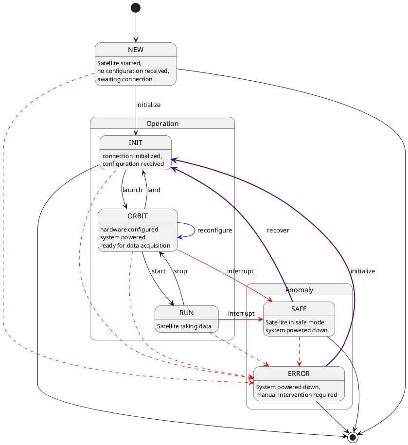

# The Constellation Satellite

## The Finite State Machine

- needs robust but keep simplicity in mind
- not too many states & transitions
- describe each state, its supposed state for the attached hardware
- provide examples (HV power supply, ramping)
- mention heartbeating, safe mode

- importance?

### States, State Changes & Expectations

- NEW
- -> loading <- unloading
- INIT
- -> launching <- landing
- ORBIT
- -> starting <- stopping <-> reconfiguring
- RUN
- SAFE
- -> recover (to INIT)
- ERROR
- -> initialize (to INIT)

## Commands

- commands comprise fsm transitions and more
- getters to get additional information on satellite
- fsm states: send CSCP message with type `REQUEST` and command string `transit::<state>` (e.g. transition to initialized state: `REQUEST "transit::init`)
- obtaining additional information via `REQUEST` and command string `get::<cmd>`
- a list of available commands shall be returned with `REQUEST "get::commands`
