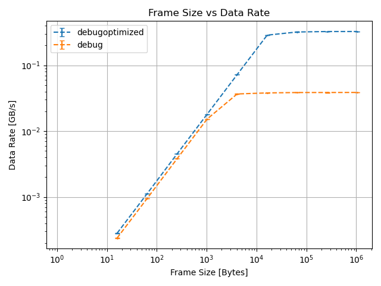

# Increase Data Rate in C++

Constellation allows sending data messages with multiple binary "payloads" or "frames" per message. If the total payload
of a message is small, the header of that message becomes significant and can lead to low data rates.

To increase the data rate, two things can be done:

- bundle data together to create larger frames
- attach multiple frames to a single message

## Impact of Larger Frames

The maximum data rate scales roughly linearly with the frame size until a certain limit is reached, either on the generation
by the sending side or due to a network interface limitation. Below a benchmark is shown using the
[`RandomTransmitter`](../../satellites/RandomTransmitter) and [`DevNullReceiver`](../../satellites/DevNullReceiver)
satellites. In a debugoptimized build, at a frame size of 16kiB the [`RandomTransmitter`](../../satellites/RandomTransmitter)
cannot generate random data faster than the [`DevNullReceiver`](../../satellites/DevNullReceiver) can receive.



```{note}
Benchmarks shown here should not be taken at face value since they heavily depend on the specs of the system generating
these benchmarks.
```

Note that debug builds can be significantly slower, particular on the sending side. A debugoptimized or release build is
recommend for production.

## Impact of more Frames per Message

If larger frame sizes are not possible, an alternative is appending multiple smaller frames to a message. This does not scale
as effectively as increasing the frame size, but still gives a significant improvement. In the benchmark below frames with a
size of 64 Bytes are added to a single message.


Appending multiple frames can be done like this:

```c++
// Create a new message and reserve space for 10 frames
auto msg = newDataMessage(10);
// Add data from detector to message until no more data comes
try {
    for(int i = 0; i < 10; ++i) {
        msg.addFrame(readDataFromDetector());
    }
catch(const NoMoreDataError& error) {}
// Send message
const auto sent = sendDataMessage(msg);
```
