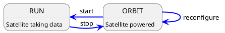

# Implementing a new Satellite in C++

This how-to guide will walk through the implementation of a new satellite, written in C++, step by step. The entire
procedure should not take too long, but this of course depends on the complexity of the satellite functionality.
It is recommended to have a peek into the overall [concept of satellites](../concepts/satellite.md) in Constellation in
order to get an impression of which functionality of the application could fit into which state of the finite state machine.

```{note}
This how-to describes the procedure of implementing a new Constellation satellite in C++. For Python look [here](./satellite_py.md) and
for the microcontroller implementation, please refer to the [MicroSat project](https://gitlab.desy.de/constellation/microsat/).
```

## Sending or Receiving Data

The first decision that needs to be taken is whether the satellite will produce and transmit data, or if it will receive and
process data from other satellites.

## Implementing the FSM Transitions

In Constellation, actions such as device configuration and initialization are realized through so-called transitional states
which are entered by a command and exited as soon as their action is complete. A more detailed description on this can be found
in the [satellite section](../concepts/satellite.md) of the framework concepts overview. The actions attached to these
transitional states are implemented by overriding the virtual methods provided by the `Satellite` base class.

For a new satellite, the following transitional state actions **should be implemented**:

* `void NewSatellite::initializing(config::Configuration& config)`
* `void NewSatellite::launching()`
* `void NewSatellite::landing()`
* `void NewSatellite::starting(std::string_view run_identifier)`
* `void NewSatellite::stopping()`

The following transitional state actions are optional:

* `void NewSatellite::reconfiguring(const config::Configuration& config)`: implements a fast partial reconfiguration of the satellite, see below for a detailed description.
* `void NewSatellite::interrupting()`: this is the transition to the `SAFE` state and defaults to `stopping` (if necessary because current state is `RUN`), followed by `landing`. If desired, this can be overwritten with a custom action.

For the steady state action for the `RUN` state, see below.

## Running and the Stop Token

The satellite's `RUN` state is governed by the `running` action, which - just as the transitional state actions above - is overridden from the `Satellite` base class.
The function will be called upon entering the `RUN` state (and after the `starting` action has completed) and is expected to finish as quickly as possible when the
`stop` command is received. The function comes with the `stop_token` parameter which should be used to check for a pending stop request, e.g. like:

```cpp
void NewSatellite::running(const std::stop_token& stop_token) {

    while(!stop_token.stop_requested()) {
        // Do work
    }

    // No heavy lifting should be performed here once a stop has been requested
}
```

```{note}
Any finalization of the measurement run should be performed in the `stopping` action rather than at the end of the `running` function, if possible:
```

```cpp
void NewSatellite::stopping() {
    // Perform cleanup action here
}
```


## To Reconfigure or Not To Reconfigure

Reconfiguration (partial, fast update of individual parameters) is an optional transition from `ORBIT` to `ORBIT` state. It can
be useful to implement this to allow e.g. fast parameter scans which directly cycle from `RUN` to `ORBIT`, through reconfigure
and back to `RUN`:



without the necessity to land and complete re-initializing the satellite.

However, not all parameters or all hardware is suitable for this, so this transition is optional and needs to be explicitly
enabled in the constructor of the satellite:

```cpp
MySatellite(std::string_view type, std::string_view name) : Satellite(type, name) {
   support_reconfigure();
}
```

and the corresponding transition function `reconfiguring(const config::Configuration& config)` needs to be implemented.

The payload of this method is a partial configuration which contains only the keys to be changed. The satellite
implementation should check for the validity of all keys and report in case invalid keys are found.

## Error Handling

Any error that prevents the satellite from functioning (or from functioning *properly*) should throw an exception to notify
the framework of the problem. The Constellation core library provides different exception types for this purpose.

### Generic Errors

* `SatelliteError` is a generic exception which can be used if none of the other available exception types match the situation.
* `CommunicationError` can be used to indicate a failed communication with attached hardware components.

### Configuration Errors

* `MissingKeyError` should be thrown when a mandatory configuration key is absent.
* `InvalidValueError` should be used when a value read from the configuration is not valid.

The message provided with the exception should be as descriptive as possible. It will both be logged and will be used as
status message by the satellite.
