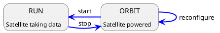

# Implementing a new Satellite in C++

This how-to guide will walk through the implementation of a new satellite, written in C++, step by step. The entire
procedure should not take too long, but this of course depends on the complexity of the satellite functionality.
It is recommended to have a peek into the overall [concept of satellites](../concepts/satellite.md) in Constellation in
order to get an impression of which functionality of the application could fit into which state of the finite state machine.

```{note}
This how-to describes the procedure of implementing a new Constellation satellite in C++. For Python look [here](./satellite_py.md) and
for the microcontroller implementation, please refer to the [MicroSat project](https://gitlab.desy.de/constellation/microsat/).
```

## Implementing the FSM Transitions

In Constellation, actions such as device configuration and initialization are realized through so-called transitional states
which are entered by a command and exited as soon as their action is complete. A more detailed description on this can be found
in the [satellite section](../concepts/satellite.md) of the framework concepts overview. The actions attached to these
transitional states are implemented by overriding the virtual methods provided by the {cpp:class}`Satellite <constellation::satellite::Satellite>` base class.

For a new satellite, the following transitional state actions **should be implemented**:

* `void ExampleSatellite::initializing(config::Configuration& config)`
* `void ExampleSatellite::launching()`
* `void ExampleSatellite::landing()`
* `void ExampleSatellite::starting(std::string_view run_identifier)`
* `void ExampleSatellite::stopping()`

The following transitional state actions are optional:

* `void ExampleSatellite::reconfiguring(const config::Configuration& config)`: implements a fast partial reconfiguration of the satellite, see below for a detailed description.
* `void ExampleSatellite::interrupting()`: this is the transition to the `SAFE` state and defaults to `stopping` (if necessary because current state is `RUN`), followed by `landing`. If desired, this can be overwritten with a custom action.

For the steady state action for the `RUN` state, see below.

```{note}
Reading information from the satellite configuration is only possible in the `initializing` function.
All parameters the satellite requires should be read and validated in this function, the `launching` function should only be used to apply this configuration to hardware.
```

## Running and the Stop Token

The satellite's `RUN` state is governed by the `running` action, which - just as the transitional state actions above - is overridden from the `Satellite` base class.
The function will be called upon entering the `RUN` state (and after the `starting` action has completed) and is expected to finish as quickly as possible when the
`stop` command is received. The function comes with the `stop_token` parameter which should be used to check for a pending stop request, e.g. like:

```cpp
void ExampleSatellite::running(const std::stop_token& stop_token) {

    while(!stop_token.stop_requested()) {
        // Do work
    }

    // No heavy lifting should be performed here once a stop has been requested
}
```

```{note}
Any finalization of the measurement run should be performed in the `stopping` action rather than at the end of the `running` function, if possible:
```

```cpp
void ExampleSatellite::stopping() {
    // Perform cleanup action here
}
```

## To Reconfigure or Not To Reconfigure

Reconfiguration (partial, fast update of individual parameters) is an optional transition from `ORBIT` to `ORBIT` state. It can
be useful to implement this to allow e.g. fast parameter scans which directly cycle from `RUN` to `ORBIT`, through reconfigure
and back to `RUN`:



without the necessity to land and complete re-initializing the satellite.

However, not all parameters or all hardware is suitable for this, so this transition is optional and needs to be explicitly
enabled in the constructor of the satellite:

```cpp
ExampleSatellite(std::string_view type, std::string_view name) : Satellite(type, name) {
   support_reconfigure();
}
```

and the corresponding transition function `reconfiguring(const config::Configuration& config)` needs to be implemented.

The payload of this method is a partial configuration which contains only the keys to be changed. The satellite
implementation should check for the validity of all keys and report in case invalid keys are found.

## Error Handling

Any error that prevents the satellite from functioning (or from functioning *properly*) should throw an exception to notify
the framework of the problem. The Constellation core library provides different exception types for this purpose.

### Generic Errors

* `SatelliteError` is a generic exception which can be used if none of the other available exception types match the situation.
* `CommunicationError` can be used to indicate a failed communication with attached hardware components.

### Configuration Errors

* `MissingKeyError` should be thrown when a mandatory configuration key is absent.
* `InvalidValueError` should be used when a value read from the configuration is not valid.

The message provided with the exception should be as descriptive as possible. It will both be logged and will be used as
status message by the satellite.

## Transmitting Data

The {cpp:class}`TransmitterSatellite <constellation::satellite::TransmitterSatellite>` base class provides functions to transmit
data. To use it the inheritance can simply be changed from {cpp:class}`Satellite <constellation::satellite::Satellite>`.

To send data in the `RUN` state, a new data message can be created with {cpp:func}`TransmitterSatellite::newDataMessage() <constellation::satellite::TransmitterSatellite::newDataMessage()>`.
Data can be added to the message as new data frame with {cpp:func}`DataMessage::addFrame() <constellation::satellite::TransmitterSatellite::DataMessage::addFrame()>`,
which requires requires creating a {cpp:class}`PayloadBuffer <constellation::message::PayloadBuffer>`.
For the most common C++ ranges like `std::vector` or `std::array`, moving the object into the payload buffer with `std::move()` is sufficient.
Optionally tags can be added to the data message for additional meta information using {cpp:func}`DataMessage::addTag() <constellation::satellite::TransmitterSatellite::DataMessage::addTag()>`.
Finally the message can be send using {cpp:func}`TransmitterSatellite::sendDataMessage() <constellation::satellite::TransmitterSatellite::sendDataMessage()>`,
which returns if the message was sent (or added to the send queue) successfully. This return value has to be checked, since
a return value of `false` indicates that the message could not be sent due to a slow receiver. In this case, one can either
discard the message, try to send it again or throw an exception to abort the run.

For performance considerations, please see [Increase Data Rate in C++](data_transmission_speed.md).

### Metadata

Constellation provides the option to attach metadata to each message sent by the satellite. There are three possibilities:

* Metadata available at the beginning of the run such as additional hardware information or firmware revisions can be attached
  to the begin-of-run (BOR) message. This has to be performed in the `starting()` function:

  ```cpp
  void ExampleSatellite::starting(std::string_view /*run_identifier*/) {
      setBORTag("firmware_version", version);
  }
  ```

  In addition to these user-provided tags, the payload of the BOR message contains the full satellite configuration.

* Similarly, for metadata only available at the end of the run such as aggregate statistics, end-of-run (EOR) tags can be set
  in the `stopping()` function:

  ```cpp
  void ExampleSatellite::stopping() {
      setEORTag("total_pixels", pixel_count);
  }
  ```

  In addition to these user-provided tags, the payload of the EOR message contains aggregate data on the run provided by the
  framework such as the total number of messages sent.

* Finally, metadata can be attached to each individual data message sent during the run:

  ```cpp
  // Create a new message
  auto msg = newDataMessage();

  // Add timestamps in picoseconds
  msg.addTag("timestamp_begin", ts_start_pico);
  msg.addTag("timestamp_end", ts_end_pico);
  ```

## Building the Satellite

Constellation uses the [Meson build system](https://mesonbuild.com/) and setting up a `meson.build` file is required for the
code to by compiled. The file should contain the following sections and variable definitions:

* First, the type this satellite identifies as should be defined by setting:

  ```meson
  satellite_type = 'Example'
  ```

  This will be the type by which new satellites are invoked and which will become part of the canonical name of each
  instance, e.g. `Example.MySat`.

* Then the source files which need to be compiled for this satellite should be listed in the `satellite_sources` variable:

  ```meson
  satellite_sources = files(
    'ExampleSatellite.cpp',
  )
  ```

* Lastly, potential dependencies of this satellite should be resolved:

    ```meson
    my_dep = dependency('TheLibrary')
    ```

    More details on Meson dependencies can be found [elsewhere](https://mesonbuild.com/Dependencies.html).
    Then, all dependencies should be gathered in a list:

    ```meson
    satellite_dependencies = [my_dep]
    ```

* Constellation automatically generates the shared library for the satellite as well as an executable. This requires that the
  type, the sources and the dependencies are added to the `satellites_to_build` variable like this:

  ```meson
  satellites_to_build += [[satellite_type, satellite_sources, satellite_dependencies]]
  ```

* To include the newly created `meson.build` file in the build process, it has to be added to the `cxx/satellite/meson.build`
  file using `subdir('Example')`.

* An option can be added to make it selectable if the satellite is build in the top-level `meson_options.txt` file:

  ```meson
  option('satellite_example', type: 'boolean', value: false, description: 'Build Example satellite')
  ```

  In the `meson.build` file for the satellite this option has to be checked.
  These lines at the begging of the `meson.build` file result in a satellite being built by default:

  ```meson
  if not get_option('satellite_example')
    subdir_done()
  endif
  ```

  The satellite can now be enabled with `meson configure build -Dsatellite_example=true`.
