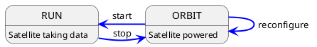

# Implementing a new Satellite in C++

This how-to guide will walk through the implementation of a new satellite, written in C++, step by step. The entire
procedure should not take too long, but this of course depends on the complexity of the satellite functionality.
It is recommended to have a peek into the overall [concept of satellites](/manual/concepts/satellite) in Constellation in
order to get an impression of which functionality of the application could fit into which state of the finite state machine.

```{note}
This how-to describes the procedure of implementing a new satellite for Constellation in C++. For Python look [here]() and
for the microcontroller implementation, please refer to [MicroSat]().
```

## Sending or Receiving Data

The first decision that needs to be taken is whether the satellite will produce and transmit data, or if it will receive and
process data from other satellites.

## Implementing the FSM Transitions

*
*
*
*
*

## Running and the Stop Token

```cpp
void NewSatellite::running(const std::stop_token& stop_token) {

    while(!stop_token.stop_requested()) {
      // Do work
    }
}
```

## To Reconfigure or Not To Reconfigure

Reconfiguration (partial, fast update of individual parameters) is an optional transition from ORBIT to ORBIT state. It can
be useful to implement this to allow e.g. fast parameter scans which directly cycle from RUN to ORBIT, through reconfigure
and back to RUN:



without the necessity to land and complete reinitializing the satellite.

However, not all parameters or all hardware is suitable for this, so this transition is optional and needs to be explicitly
enabled in the constructor of the satellite:

```cpp
MySatellite(std::string_view name) : Satellite(name) {
   enable reconfiguration();
}
```

and the corresponding transition function `reconfiguring()` needs to be implemented.

The payload of this method is a partial configuration which contains only the keys to be changed. The satellite
implementation should check for the validity of all keys and (...except?) in case invalid keys are found.

## Error Handling

Any error that prevents the satellite from functioning (or from functioning *properly*) should throw an exception to notify
the framework of the problem. The Constellation core library provides different exception types for this purpose:

* `CommunicationError` can be used to indicate a failed communication with attached hardware components.
* `MissingKeyError` should be thrown when a mandatory configuration key is absent.
* `InvalidValueError` should be used when a value read from the configuration is not valid.
* `SatelliteError` is a generic exception which can be used if none of the above match the situation.

The message provided with the exception should be as descriptive as possible. It will both be logged and will be used as
status message by the satellite.
