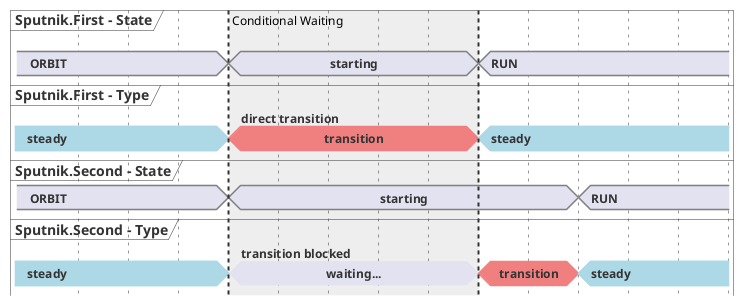
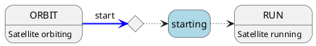

# Autonomous Operation

Constellations operate decentralized, each satellite runs autonomously and no central server which manages a common state
is required. Controllers and listeners constitute the user interfaces and are entirely stateless. The following sections
will introduce the autonomy concept and illustrate its features.

## Heartbeating

The communication of state information between the individual components of a Constellation is performed through so-called heartbeat messages
emitted by the satellites. These messages contain the [finite state machine](satellite.md#the-finite-state-machine) state and
a set of flags which define the role of the sending satellite and which will be explained below.
In addition to regular heartbeat messages, satellites emit so-called extrasystoles whenever their FSM state has changed.
This ensures timely distribution of information to all Constellation constituents.

The interval between the regular heartbeat messages is automatically scaled according to the number of active hosts in the
Constellation to avoid congestion.

```{seealso}
A detailed technical description, including protocol sequence diagrams, can be found in the
[protocol description chapter](../../framework_reference/protocols.md#autonomous-operation) in the framework development guide.
```

## Satellite Autonomy & Roles

Satellites in a Constellation operate autonomously. This requires additional information on how to react in case of
failures or unforeseen situations. Following the decentralized approach of Constellation, this information is
provided by each satellite via their heartbeats. Each satellite defines independently how other satellites in the
Constellation should react in case of problems.

Satellites can convey information to the Constellation by a number of possibilities:

* The satellite can send a heartbeat message
* The satellite can stop sending heartbeats, e.g. because of a network issue or because the satellite program exited abnormally
* The satellite transmits its state through heartbeat messages
* The satellite can depart by informing the Constellation about the unavailability of its services

Roles group the actions taken by the Constellation in each of these cases into an easily-configurable parameter. The role
is configured for the *sending* satellite and is transmitted via heartbeat message flags to the receivers throughout the
Constellation. The following roles exist and can be configured through the `_role` parameter:

* `ESSENTIAL` satellites are considered key to the running Constellation. Their information is treated most strictly, in
  particular
  * any reported {bdg-secondary}`ERROR` or {bdg-secondary}`SAFE` state triggers an interrupt in other satellites
  * a timeout in receiving heartbeats from an `ESSENTIAL` satellite triggers an interrupt in other satellites
  * an orderly departure of a `ESSENTIAL` satellite triggers an interrupt in {bdg-secondary}`ORBIT` and {bdg-secondary}`RUN` states
  * any of the above will lead to the current run being marked with the *degraded* flag.

* `DYNAMIC` satellites are the default constituents, where
  * any reported {bdg-secondary}`ERROR` or {bdg-secondary}`SAFE` state triggers an interrupt
  * a timeout in receiving heartbeats triggers an interrupt in other satellites
  * an orderly departure of an `DYNAMIC` satellite **is allowed** and only an information about the departure is logged
  * any of the above will lead to the current run being marked with the *degraded* flag.

* `TRANSIENT` satellites are more volatile components in a Constellation, namely
  * any reported {bdg-secondary}`ERROR` or {bdg-secondary}`SAFE` state **only logs a warning** but does not trigger an interrupt
  * a timeout in receiving heartbeat messages **logs a warning**
  * an orderly departure of an `TRANSIENT` satellite **is allowed** and only an information about the departure is logged
  * any of the above will lead to the current run being marked with the *degraded* flag.

* Satellites with the role `NONE` are mere spectators,
  * any reported {bdg-secondary}`ERROR` or {bdg-secondary}`SAFE` state **only logs a warning**
  * a timeout in receiving heartbeat messages **logs a warning**
  * an orderly departure of an `NONE` satellite **is allowed** and only an information about the departure is logged
  * The run metadata flags of the current run are not affected by this satellite.

The default role of satellites is the `DYNAMIC` role, the currently configured role can be requested with the `get_role`
command.

## Conditional Transitions

In some cases it can be required to initialize, launch, start or stop satellites in a specific order - they might for example
depend on receiving a hardware clock from another satellite that is only available after initializing.

For this purpose, Constellation provides the `_require_<transitional state>_after` keywords, available for each transition.
The respective satellite will receive these as conditions from the controller via the configuration passed in the
`initialize` command and evaluate them upon entering transitional states.

If, for example, Satellite `Sputnik.Second` receives the condition `_require_starting_after = "Sputnik.First"` it will enter
the {bdg-secondary}`starting` transitional states but wait until satellite `Sputnik.First` has successfully completed the transition, and
`Sputnik.Second` receives the state `RUN` from `Sputnik.First` via the
[heartbeat protocol](../../framework_reference/protocols.md#autonomous-operation) before progressing through its own {bdg-secondary}`starting` state. This can
be visualized as follows:



In state diagrams, this additional condition can be denoted as follows:



Here, the diamond represents one or multiple conditions of remote satellites which need to be satisfied before continuing in
the state diagram.

This method allows satellites to asynchronously and autonomously progress from steady state to steady state without the
necessity of a controller supervising the order of action. It also allows multiple satellites waiting for the same remote
condition to progress simultaneously once the condition is fulfilled, while a transition order orchestrated by a controller
necessarily would progress sequentially.

Conditions are available for all [regular transitional states](satellite.md#changing-states---transitions) of a satellite
apart from {bdg-secondary}`reconfiguring`, i.e.

* `_require_initializing_after`
* `_require_launching_after`
* `_require_landing_after`
* `_require_starting_after`
* `_require_stopping_after`

```{warning}
Depending on the Constellation, not necessarily all combinations are valid and will function. For example, a transmitter
satellite depending on the stopping condition of a receiver satellite will eventually time out because the latter waits for
the EOR message of the former.

Also mutual dependencies on the same state will lead to deadlocks.

Some controllers might check for conflicts by building a directed graph of the dependencies, but in general the
configuration has to be tested with a running Constellation.
```

There is no restriction to the number of conditions or the number of remote satellites to depend on. When depending on
multiple satellites in one transitional state, the corresponding key can be set as array, e.g.

```toml
_require_launching_after = ["Sputnik.First", "Sputnik.Third"]
```

Conditions cannot be set on the same satellite executing the conditional transition, and they cannot be assigned to steady
states.

Waiting for remote conditions to be satisfied can be interrupted by a number of things:

* The remote satellite the condition depends on is not present or disappeared
* The remote satellite the condition depends on returns an {bdg-secondary}`ERROR` state
* The waiting satellite runs into the timeout for conditional transitions. The timeout can be configured using the key
  `_conditional_transition_timeout` and defaults to 30 seconds.

In all cases the waiting satellite aborts the pending action and transitions into its {bdg-secondary}`ERROR` state.
