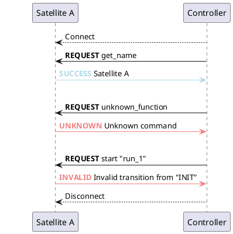

# The Controller

::::{grid}

:::{grid-item-card}
**Command Communication between Controller & Satellite**
^^^^^^^^^^^^

:::

::::

## Measurement Queues

Measurement queues are a sequence of runs which are processed one after the other, either with the same or altered parameters
for the constituents of the Constellation.
Some controllers support measurement queues to automatically reconfigure the Constellation, e.g. to scan through parameter
ranges. Individual measurements consist of

* A list of satellites and a configuration object for each of them, with the parameters to be changed
* A condition which determines the end of the measurement. This could for example be a duration or a specific value of a
  metric one of the satellites emits.

### Measurement Procedure

Usually, measurement queues will require a fully initialized and launched Constellation to operate on.
When started, the measurement queue will pick up the first measurement, send the [`reconfigure` command](./satellite.md#changing-states---transitions) to all satellites
which have configurations in the measurement, wait for the reconfiguration to succeed and then start a run. The run
identifier is usually generated from a configured prefix and a sequence number referring to the current measurement in the
queue.

The Constellation is then kept in the {bdg-secondary}`RUN` state until the condition of the measurement expires, e.g. the duration timer
reaches its timeout, or the configured metric has reached its target value or threshold.

The queue then emits the `stop` command and waits until all satellites have reached the {bdg-secondary}`ORBIT` state again before continuing
with the next measurement in the queue.

### Original Configuration Values

A queue may contain scans of different parameters. In order to avoid configuration parameters from the previous measurement
to remain active, the original values of each measurement parameter are read from the satellites using the [`get_config` command](./satellite.md#controlling-the-satellite) before the measurement is started and are cached in the queue. Whenever a parameter does not appear in the new
measurement anymore, it is reset to the original value the next time a reconfiguration is performed.

For example, a queue that contains three measurements for the same satellite, first setting the parameter `a` to values `1`
and `2`, and the parameter `b` to value `5` will first read the parameter `a` from the satellite configuration (e.g. `a = 99`), then set
`a = 1` for the first measurement and `a = 2` in the subsequent measurement.
The final measurement will set `b = 5` as well as parameter `a = 99` to its original value initially read from the satellite.

When implementing queues manually e.g. through a Python script [as described in the How-To Guide](../howtos/scanning_python.md), the original value has to be cached and reconfigured by the script.
