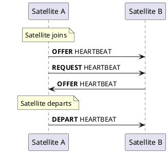

# Network Discovery

::::{grid}

:::{grid-item-card}
**Discovery Message Communication**
^^^^^^^^^^^^

```plantuml
@startuml
skinparam ParticipantPadding 50
note over "Satellite A" : Satellite joins
"Satellite A" -> "Satellite B": **OFFER** HEARTBEAT
"Satellite A" -> "Satellite B": **REQUEST** HEARTBEAT
"Satellite A" <- "Satellite B": **OFFER** HEARTBEAT
note over "Satellite A" : Satellite departs
"Satellite A" -> "Satellite B": **DEPART** HEARTBEAT
@enduml
```

:::

::::

* brief CHIRP description
* mention of firewalls, link to FAQ
*
