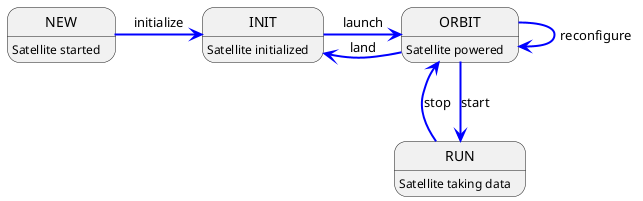
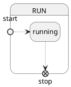
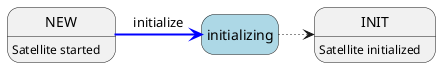
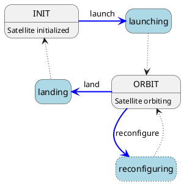

# The Satellite

The central components of a Constellation network are satellites. A satellite is a program for controlling an instrument and
is built around a finite state machine. It is the only component in a Constellation which partakes in all Constellation
protocols. In the following, the main features of the Constellation Satellite are described.

## Type and Name

The so-called canonical name of a satellite consists of two parts - its type and its name, separated by a dot. The type
represents the type (or class) of the satellite. The name can be chosen freely and unambiguously identifies a specific
satellite instance.

For example the satellite with the canonical name `Sputnik.Device1` represents a satellite of type
[Sputnik](../../satellites/Sputnik) with the name `Device1`. The satellite `Sputnik.Device2` is of the same type but has a
different name.

## State and Status

The **state** of a Constellation satellite is governed by its [finite state machine](#the-finite-state-machine). By referring to the
current state of the satellite, it can be unequivocally deduced what actions the satellite is currently performing.

Sometimes, however, additional information is helpful in interpreting this machine-readable state information. This
information is supplied by the satellite **status**, a human-readable string describing e.g. the last performed action during
a [transitional state](#changing-states---transitions). The status may change while remaining in the same state. In case of a failure, the
status string provides information on the cause of the failure, if known or available. A typical example for a regular status
information would be:

* `STATE`: {bdg-secondary}`ORBIT`
* `STATUS`: "All outputs ramped to 100V"

or for a failure mode situation:

* `STATE`: {bdg-secondary}`ERROR`
* `STATUS`: "Failed to communicate with FPGA, links not locked"

Unlike the state, which is for example distributed automatically through the heartbeat protocol, the
status message has to be explicitly queried via a [command](#controlling-the-satellite).

## Controlling the Satellite

The Constellation satellite class exposes a set of remote procedure calls, called "commands" in the following, through the
CSCP protocol. This comprises commands to initiate state transitions of the [finite state machine](#the-finite-state-machine) as well as
methods to query additional information from the satellite. A brief description of the CSCP protocol is provided
[in the protocol section](../../framework_reference/protocols.md) of the user guide and the full protocol definition and grammar can
be found in the [appendix of the developer guide](../../protocols/cscp.md).

Commands consist of a command name and an optional payload. The following commands represent the minimal set of procedures a
satellite needs to implement:

| Command        | Description
| -------------- | -----------
| `get_name`     | Returns the canonical name of the queried satellite
| `get_version`  | Returns the Constellation version identifier the satellite has been built with
| `get_commands` | Provides a full list of the available commands for the queried satellite
| `get_state`    | Returns the current [state](#the-finite-state-machine) of the satellite
| `get_role`     | Returns the current [role](./autonomy.md#satellite-autonomy--roles) of the satellite
| `get_status`   | Returns the current [status message](#state-and-status) of the satellite
| `get_config`   | Returns the applied configuration
| `get_run_id`   | Returns the current or last run identifier
| `initialize`   | Requests FSM transition "initialize". Only valid when in {bdg-secondary}`INIT` or {bdg-secondary}`NEW` states.
| `launch`       | Requests FSM transition "launch". Only valid when in {bdg-secondary}`INIT` state.
| `land`         | Requests FSM transition "land". Only valid when in {bdg-secondary}`ORBIT` state.
| `reconfigure`  | Requests FSM transition "reconfigure". Only valid when in {bdg-secondary}`ORBIT` state.
| `start`        | Requests FSM transition "start". Only valid when in {bdg-secondary}`ORBIT` state.
| `stop`         | Requests FSM transition "stop". Only valid when in {bdg-secondary}`RUN` state.
| `shutdown`     | Shuts down the satellite application. This command can only be called from the {bdg-secondary}`NEW`, {bdg-secondary}`INIT`, {bdg-secondary}`SAFE` and {bdg-secondary}`ERROR` states.

Satellite implementations are allowed to amend this list with custom commands.

## The Finite State Machine

The finite state machine (FSM) controls the behavior of the satellite and guarantees that the system is always in a defined state.
The FSM has been designed carefully to strike the balance between robustness, features, and simplicity.
State transitions are either initiated by a controller sending transition commands through CSCP for regular operation, or by
internal state changes in case of errors.
In the following, the different states and their transitions are introduced, starting from regular operations and extending
into the different failure modes.

### Normal Operation - Steady States

In regular operation, i.e. without unexpected incidents in the Constellation, the satellite FSM will transition between four
steady states. Steady here indicates that the satellite will remain in this state until either a transition is initiated by
a controller, or a failure mode is activated. The simplified state diagram for normal operation mode can be drawn like this:



The individual states of the satellite correspond to well-defined states of the attached instrument hardware as well as the
satellite communication with the rest of the Constellation:

* The {bdg-secondary}`NEW` state is the initial state of any satellite.

  It indicates that the satellite has just been started and that no connection with a controller or other satellites in the Constellation has been made.

* The {bdg-secondary}`INIT` state indicates that the satellite has been initialized.

  Initialization comprises the reception of the configuration from a controller.
  A first connection to the instrument hardware may be made at this point, using the configuration provided by the controller.

* The {bdg-secondary}`ORBIT` state signals that the satellite is ready for data taking.

  When the satellite enters this state, all instrument hardware has been configured, is powered up and is ready for entering a
  measurement run.

* The {bdg-secondary}`RUN` state represents the data acquisition mode of the satellite.

  In this state, the instrument is active and queried for data, the satellite handles measurement data, i.e. obtains data from
  the instrument and sends it across the Constellation, or receives data and stores it to file.

### Operating the Instrument - The {bdg-secondary}`RUN` State

The {bdg-secondary}`RUN` state is special in that this is where the operation of the satellite takes place, data is collected and passed on,
and telemetry data are distributed.
Satellite implementations interact with the {bdg-secondary}`RUN` state through the `running` function.
The method is called once upon entering the {bdg-secondary}`RUN` state, and should exit as soon as a state change is requested either by a
controller or by a failure mode.



Each run is assigned a run identifier via the `start` transition command. Run identifiers can consist of alphanumeric
characters, underscores or dashes. The `get_run_id` command always returns the currently active run identifier if the
satellite is in the {bdg-secondary}`RUN` state, or the last active run identifier in other cases. When the satellite has not yet entered
the {bdg-secondary}`RUN` state, the returned run identifier is empty.


### Changing States - Transitions

Instrument code of the individual satellites is executed in so-called transitional states. They differ from steady states in
that they are entered by a state transition initiated through CSCP or a failure mode, but exited automatically upon completion
of the action. Such a transition diagram is shown below:



In this example, the transition `initialize` is triggered by a command sent by the controller. The satellite enters the
{bdg-secondary}`initializing` state and works through the instrument initialization code. Upon success, the satellite automatically
transitions into the {bdg-secondary}`INIT` state and remains there, awaiting further transition commands.

In this scheme, actions controlling and setting up the instrument hardware directly correspond to transitional states. The
following transitional states are defined in the Constellation FSM:

* The {bdg-secondary}`initializing` state
* The {bdg-secondary}`launching` state
* The {bdg-secondary}`landing` state
* The {bdg-secondary}`starting` state
* The {bdg-secondary}`stopping` state

In addition, the optional {bdg-secondary}`reconfiguring` transitional state enables quick configuration updates of satellites in {bdg-secondary}`ORBIT` state
without having to pass through the {bdg-secondary}`INIT` state. A typical example for reconfiguration is a high-voltage power supply unit,
which is slowly ramped up to its target voltage in the {bdg-secondary}`launching` state. Between runs, the applied voltage is supposed to be
changed by a few volts - and instead of the time-consuming operation ramping down via the {bdg-secondary}`landing` transition and ramping up again,
the voltage is ramped directly from its current value to the target value in the {bdg-secondary}`reconfigure` transitional state:



This transition needs to be specifically implemented in individual satellites in order to make this transition available in the FSM.

### Adding Conditions

In some cases it can be required to launch, start or stop satellites in a specific order - they might for example depend on receiving a hardware clock from another satellite that is only available after initializing.

For this purpose, Constellation provides [Conditional Transitions](autonomy.md#conditional-transitions), which enables defining
a transition order using the `_require_<transition>_after` keywords provided via the satellite configuration:

```toml
[satellites.Sputnik.A]
_require_starting_after = ["Sputnik.B"]
```

The satellite will evaluate these conditions upon entering respective transitional states. If, in the above example, Satellite `Sputnik.A` receives the condition
`_require_starting_after Sputnik.B` it will enter the {bdg-secondary}`starting` transitional states but wait until it receives the state {bdg-secondary}`RUN` for satellite `Sputnik.B` before progressing through its own {bdg-secondary}`starting` state.

This method allows satellites to asynchronously progress from steady state to steady state without the necessity of a controller supervising the order of action.

### Failure Modes & Safe State

Satellites operate autonomously in the Constellation, and no central controller instance is required to run. Controllers are
only required to initiate state transitions out of steady satellite states as described above.
This situation implies that a mechanism should be in place to deal with unexpected events occurring in the operation of a single
satellite, but also within the entire Constellation. For this purpose, the satellite FSM knows two additional steady states:

The {bdg-secondary}`ERROR` state is entered whenever an unexpected event occurs within the instrument control or the data transfer. This
state can only be left by a manual intervention via a controller by resetting the satellite back into its {bdg-secondary}`INIT` state.

The {bdg-secondary}`SAFE` state on the other hand, is entered by the satellite when detecting an issue with *another* satellite in the
Constellation. This awareness of the Constellation status is achieved with the help of heartbeats. Each satellite in the
Constellation transmits its current state as a heartbeat at regular intervals. This allows other
satellites to react if the communicated status contains the {bdg-secondary}`ERROR` state - or if the heartbeat is absent for a defined
period of time.
The {bdg-secondary}`SAFE` state resembles that of an uncrewed spacecraft, where all non-essential systems are shut down and only essential
functions such as communication and attitude control are active. For a Constellation satellite this could encompass powering
down instruments or switching off voltages. Also this state can only be left by a manual intervention via a controller, and
the satellite will transfer back to its {bdg-secondary}`INIT` state.

The main difference between the two failure states is the possible statement about the condition of the respective satellite.
The {bdg-secondary}`SAFE` state is achieved via a controlled shutdown of components and is a well-defined procedure, while the {bdg-secondary}`ERROR` state
is entered, for example, through a lack of control or communication with the instrument and therefore does not allow any
statement to be made about the condition of attached hardware.

```{seealso}
More details about the autonomous operation of a Constellation can be found in [the respective section of the manual](autonomy.md).
```
