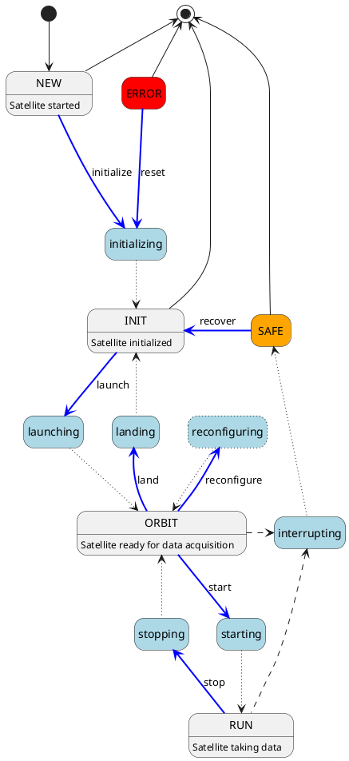

# Satellite Implementation Guidelines

The following guidelines should be followed when implementing a satellite base class for Constellation.

```{note}
These guidelines are only relevant for developing the Constellation framework itself, **not for the implementation of user satellites**.
These pages contain detailed technical information concerning the communication between Constellation components and the required
minimal set of functionality for them to interoperate with each other.
```

## Satellite Commands

Each satellite **must** be able to understand and answer tot he following commands, and it **must** accept or provide the
corresponding payloads:

| Command | payload | verb reply | payload reply
| ------- | ------- | ---------- | -------------
| `get_name` | - | Name of the Satellite | -
| `get_version` | - | Constellation version identifier string | -
| `get_commands` | - | See payload | List of commands (+ description+payload?)
| `get_state` | - | Current state (as string) | -
| `get_status` | - | Current status | -
| `get_config` | - | Current config | -
| `initialize` | Config | Acknowledgement | -
| `launch` | - | Acknowledgement | -
| `land` | - | Acknowledgement | -
| `reconfigure` | Partial config | Acknowledgement | -
| `start` | Run number | Acknowledgement | -
| `stop` | - | Acknowledgement | -

## FSM States

The state can be encoded in a single-byte value.

State values with the lower four bits set to zero indicate steady states. For state values with non-zero lower four bits, the higher four bits indicate the steady state they enter into.

The following states are defined:

* `0x10` - NEW
* `0x12` - initializing
* `0x20` - INIT
* `0x23` - launching
* `0x30` - ORBIT
* `0x32` - landing
* `0x33` - reconfiguring
* `0x34` - starting
* `0x40` - RUN
* `0x43` - stopping
* `0x0E` - interrupting
* `0xE0` - SAFE
* `0xF0` - ERROR

## FSM State & Transition Diagram

The following diagram represents all possible transitions and states of the Constellation FSM. The different colors and line
styles indicate different types of transitions and states:

* Gray boxes represent steady states which are left only through an error condition or user intervention.
* Light blue boxes represent transitional states which are exited as soon as their defined action has been completed.
* Dark blue arrows indicate transitions triggered by user-interaction
* Dotted lines indicate automatic transitions, triggered upon action completion
* Dashed lines indicate transitions triggered by an error condition.

It should be noted that every state can transit into the `ERROR` state and corresponding arrows for these transitions are
omitted from the diagram for clarity.


