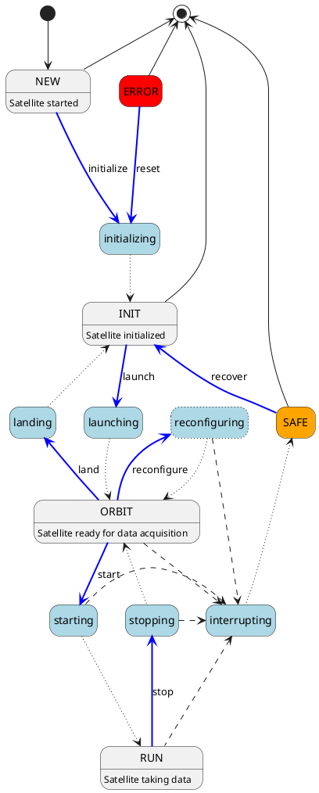

# Satellite Implementation Guidelines

## FSM States

The state can be encoded in a single-byte value.

State values with the lower four bits set to zero indicate steady states. For state values with non-zero lower four bits, the higher four bits indicate the steady state they enter into.

The following states are defined:

* `0x00` - NEW
* `0x10` - INIT
* `0x11` - initializing
* `0x12` - landing
* `0x20` - ORBIT
* `0x21` - launching
* `0x22` - reconfiguring
* `0x23` - stopping
* `0x30` - RUN
* `0x31` - starting
* `0xE0` - SAFE
* `0xE1` - interrupting
* `0xF0` - ERROR

## FSM State & Transition Diagram

The following diagram represents all possible transitions and states of the Constellation FSM. The different colors and line
styles indicate different types of transitions and states:

* Gray boxes represent steady states which are left only through an error condition or user intervention.
* Light blue boxes represent transitional states which are exited as soon as their defined action has been completed.
* Dark blue arrows indicate transitions triggered by user-interaction
* Dotted lines indicate automatic transitions, triggered upon action completion
* Dashed lines indicate transitions triggered by an error condition.

It should be noted that every state can transit into the `ERROR` state and corresponding arrows for these transitions are
omitted from the diagram for clarity.

